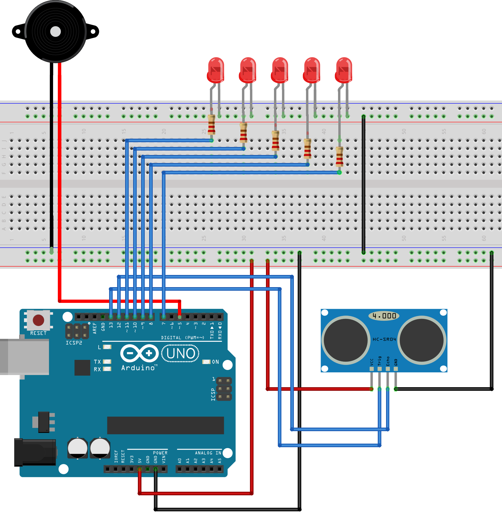

# Car-Reverse-Parking-Device-Arduino
Car reverse parking safety device with LED bar graph

### Table of Content
-01 [Project Overview](#overview)</br>
-02 [Final Output](#output)</br>
-03 [Components Required](#required)</br>
-04 [Circuit Diagram](#diagram)</br>
-05 [Principle of the Circuit](#principle)</br>
-06 [Code](#code)</br>
-07 [Code Explanation](#explanation)</br>


## 01. Project Overview <a name="overview"/>


## 02. Final Output <a name="output"/>


## 03. Components Required<a name="required"/>
   - Arduino UNO X 1
   - HC-SR04 Ultrasonic Sensor X 1
   - Buzzer X 1
   - LED X 5
   - 220Ω Resisters X 5
   - Connecting Wires
   - Breadboard
   

## 04. Circuit Diagram<a name="diagram"/>





## 05. Principle of the Circuit<a name="principle"/>


## 06. Code<a name="code"/>

```
const int trigpin  = 13;
const int echopin = 12;
const int ledPin1 = 7;
const int ledPin2 = 8;
const int ledPin3 = 9;
const int ledPin4 = 10;
const int ledPin5 = 11;
const int buzzer = 5;

long duration;
int distance;
int saftyDistance;

void setup() {
  pinMode(trigpin, OUTPUT);
  pinMode(echopin, INPUT);
  pinMode(ledPin1, OUTPUT);
  pinMode(ledPin2, OUTPUT);
  pinMode(ledPin3, OUTPUT);
  pinMode(ledPin4, OUTPUT);
  pinMode(ledPin5, OUTPUT);
  pinMode(buzzer, OUTPUT);
  Serial.begin(9600);
}

void loop() {

  digitalWrite(trigpin, LOW);
  delayMicroseconds(2);

  digitalWrite(trigpin, HIGH);
  delayMicroseconds(10);
  
  digitalWrite(trigpin, LOW);
  
  duration = pulseIn(echopin, HIGH);
  distance = duration*0.034/2;

  saftyDistance = distance;

  if(saftyDistance >= 25){          //comfortable zone
    digitalWrite(ledPin1, LOW);
    digitalWrite(ledPin2, LOW);  
    digitalWrite(ledPin3, LOW);
    digitalWrite(ledPin4, LOW);
    digitalWrite(ledPin5, LOW);
    digitalWrite(buzzer, LOW);
    }
  
  if(saftyDistance <= 25){         //minimum distance alert
    digitalWrite(ledPin1, HIGH); 
    digitalWrite(ledPin2, LOW);  
    digitalWrite(ledPin3, LOW);
    digitalWrite(ledPin4, LOW);
    digitalWrite(ledPin5, LOW);
    tone(buzzer, 1000, 100); 
    }
    
  if(saftyDistance <= 20){        //mid range next alert
    digitalWrite(ledPin1, HIGH);
    digitalWrite(ledPin2, HIGH);  
    digitalWrite(ledPin3, LOW);
    digitalWrite(ledPin4, LOW);
    digitalWrite(ledPin5, LOW); 
    tone(buzzer, 1000, 100); 
    }
    
   if(saftyDistance <= 15){        //mid range next alert
    digitalWrite(ledPin1, HIGH);
    digitalWrite(ledPin2, HIGH); 
    digitalWrite(ledPin3, HIGH);
    digitalWrite(ledPin4, LOW);
    digitalWrite(ledPin5, LOW);
    tone(buzzer, 1000, 100);  
    }
    
  if(saftyDistance <= 10){        //danger zone next alert
    digitalWrite(ledPin1, HIGH);
    digitalWrite(ledPin2, HIGH);
    digitalWrite(ledPin3, HIGH);
    digitalWrite(ledPin4, HIGH);
    digitalWrite(ledPin5, LOW);  
    tone(buzzer, 1000, 100); 
    }
    
  if(saftyDistance <= 5){        //absolutely danger zone alert
    digitalWrite(ledPin1, HIGH);
    digitalWrite(ledPin2, HIGH);
    digitalWrite(ledPin3, HIGH);
    digitalWrite(ledPin4, HIGH);
    digitalWrite(ledPin5, HIGH);  
    tone(buzzer, 1000, 100);
    }
  
   Serial.println("Distance: ");  
   Serial.println(distance);
    
  delay(250);
 
}
```


## 07. Code Explanation<a name="explanation"/>

First we have to define all pin we used in arduino uno board.


